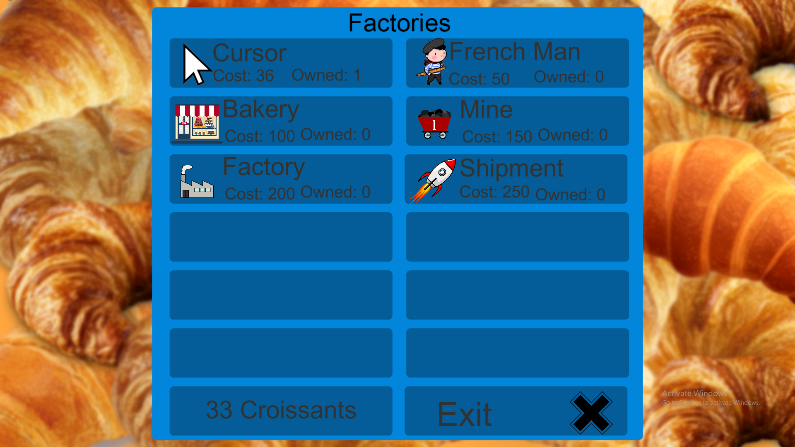
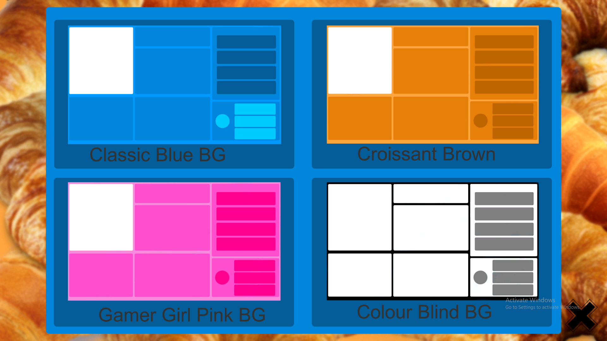

# Croissant Clicker

Tired of clicking on cookies?

Why not swap it out for some croissant fun?

xD

<p float="left">
  
   
  
</p>

## Installation

#### Using Windows?
```
Do to releases and download the zip.
```
[releases](https://github.com/Animeboynz/CroissantClicker/releases)
#### Using a Mac?

```
Sounds like your own damb fault. 
Na JK just build it yourself using unity.
```

## Usage

```
Click on the god damb croissant, what more do you need.
```

Created in conjunction with user [Sp00dies](https://github.com/spoodies)
